<div align="center">


<br/>

[](https://github.com/)

<br/>


<br/><br/>

```text
🚛  FLEET  →  🧑‍✈️ DRIVERS  →  🗺️ DISPATCH  →  🔧 SHOP  →  ⛽ FUEL & EXPENSES  →  📊 ROI
```

</div>

---

## 📖 Table of Contents

- [1. Overview](#1-overview)
- [2. Technology Stack](#2-technology-stack)
- [3. Credentials & Roles](#3-credentials--roles)
- [4. Architecture & Data Flow](#4-architecture--data-flow)
- [5. Repository Structure](#5-repository-structure)
- [6. Application Features](#6-application-features)
- [7. Module Walkthrough & Screenshots](#7-module-walkthrough--screenshots)
  - [7.1 Portal Authentication](#71-portal-authentication)
  - [7.2 Fleet Manager Module](#72-fleet-manager-module)
  - [7.3 Driver Module](#73-driver-module)
  - [7.4 Safety Officer Module](#74-safety-officer-module)
  - [7.5 Financial Analyst Module](#75-financial-analyst-module)
  - [7.6 Database View (MongoDB)](#76-database-view-mongodb)
- [8. Enforced Business Rules](#8-enforced-business-rules)
- [9. Setup & Local Development](#9-setup--local-development)

---

## 1. Overview

**TransitOps Control Tower** is a full-stack smart transport operations platform designed to digitize vehicle, driver, trip dispatch, maintenance, fuel logs, and expenses. It features role-based access control (RBAC), automatic status transitions, email-verification registration (OTP flow), and key performance indicators (KPIs) to prevent common logistical issues like vehicle double-booking, driver license expiry violations, and load capacity overload.

---

## 2. Technology Stack

<div align="center">

</div>

### Frontend
- **Framework**: React 19 + Vite 8 + TypeScript
- **Styling**: TailwindCSS v4 (Space-dark theme, custom glassmorphism panels, and smooth animations)
- **State Management & Data Fetching**: TanStack Query (React Query) + Zustand
- **Routing**: React Router v6 (integrated with Protected Route RBAC guards)
- **Charts**: Recharts (for fleet utilization trends, cost distributions, and vehicle ROI)
- **Icons / Alerts**: Lucide React + custom styled warnings

### Backend
- **Runtime**: Node.js + Express 5
- **ORM / Database Wrapper**: Mongoose
- **Database**: MongoDB (Mongoose connection to local or cloud instances)
- **Authentication**: JWT (JSON Web Tokens) & Password Hashing (bcryptjs)
- **Nodemailer**: Integrated SMTP transporter for generating and emailing OTPs during sign-up.

---

## 3. Credentials & Roles

The system validates credentials and enforces strict role checks during login. Four primary roles have tailored access permissions across dashboards and management ledgers:

| # | Role | Email | Password | Allowed Access Views |
|---|---|---|---|---|
| 1 | **Fleet Manager** | `fleet@gmail.com` | `fleet@123` | Dashboard, Vehicles, Drivers (view), Trips, Maintenance, Reports |
| 2 | **Safety Officer** | `safety@gmail.com` | `Safety@123` | Dashboard, Drivers (CRUD) |
| 3 | **Driver** | `driver@gmail.com` | `Driver@123` | Dashboard, Vehicles, Drivers, Trips, Maintenance, Expenses, Reports |
| 4 | **Financial Analyst** | `financial@gmail.com` | `Financial@123` | Dashboard, Vehicles, Drivers, Trips, Maintenance, Fuel & Expenses, Reports (with stars-scrolling backdrop) |

---

## 4. Architecture & Data Flow

TransitOps architecture coordinates high-fidelity client views, route security, and transaction logic on the Express backend backed by a MongoDB document cluster:

<p align="center">
  
</p>

### Critical Flow Automations:
1. **Sign-Up Verification**: A user registers $\rightarrow$ Nodemailer sends a 6-digit OTP $\rightarrow$ Verification completes $\rightarrow$ JWT issued.
2. **Trip Dispatch**: Dispatching a trip marks the assigned vehicle and driver status as `ON_TRIP` atomically.
3. **Trip Completion**: Inputting odometer + fuel cost updates vehicle mileage, creates fuel ledger invoices, and restores statuses to `AVAILABLE`.
4. **Maintenance Open**: Setting a vehicle into a maintenance log sets its status to `IN_SHOP`, removing it from the eligible trip-dispatch selection list.

---

## 5. Repository Structure

```text
TransitOps/
├── backend/
│   ├── src/
│   │   ├── controllers/      # Route-handling controllers (auth, drivers, trips, vehicles)
│   │   ├── models/           # Mongoose Database Schemas (User, Vehicle, Driver, Trip, AuthToken)
│   │   ├── routes/           # Express API endpoints
│   │   ├── db.ts             # MongoDB Mongoose driver connectivity handler
│   │   └── server.ts         # Express server instance configuration (Port 5000)
│   ├── .env                  # Port, JWT Secret, MONGO_URI, and SMTP Email credentials
│   ├── package.json          # Node dependencies
│   └── seed.js               # Seed script for initial vehicles and drivers
├── frontend/
│   ├── public/               # Images and screenshots of dashboards
│   ├── src/
│   │   ├── api/
│   │   │   ├── mockDb.ts     # Client fallback database structure
│   │   │   └── apiClient.ts  # Endpoint handlers requesting Express /api
│   │   ├── components/       # Custom layouts (Sidebar, Topbar, ProtectedRoute, SpaceBackground)
│   │   ├── context/
│   │   │   └── AuthContext.tsx # Authentication states (Login, Register, OTP Validation)
│   │   ├── pages/            # Modules (Dashboard, Vehicles, Drivers, Trips, Maintenance, Expenses, Reports)
│   │   ├── App.tsx           # Page routing configuration and provider scopes
│   │   └── index.css         # Custom animations and Tailwind styles
│   └── vite.config.ts        # Vite configuration (proxy setting for `/api` pointing to `:5000`)
└── README.md
```

---

## 6. Application Features

1. **Email OTP Verification**: Registration triggers an email with a 6-digit validation OTP code using Gmail SMTP service.
2. **Operations Dashboard**: Provides 7 essential fleet KPIs, active trips logs, and detailed safety alerts logs for officers.
3. **Live Vehicle Registry**: Handles registration, model name, odometer tracking, regions, and acquisition costs.
4. **Driver Compliance Dashboard**: Shows driver safety scores, license categories, and triggers visual bell notifications for licenses expiring within 30 days.
5. **Overload Prevention Control**: Trip dispatcher dynamically alerts dispatchers if the selected cargo weight exceeds the vehicle's maximum capability.
6. **Detailed Fuel & Expenses Ledger**: Records fuel fills, toll fees, and maintenance costs dynamically calculated to audit operational ROI.
7. **Reports & ROI Analytics**: Visualizes monthly revenue trends, vehicle cost allocation, and overall return-on-investment parameters.
8. **Premium Space Effect**: Integrates an elegant star scrolling backdrop exclusively visible for the Financial Analyst role.

---

## 7. Module Walkthrough & Screenshots

### 7.1 Portal Authentication
The entrance screen offers dual support for credentials input and role mapping parameters.
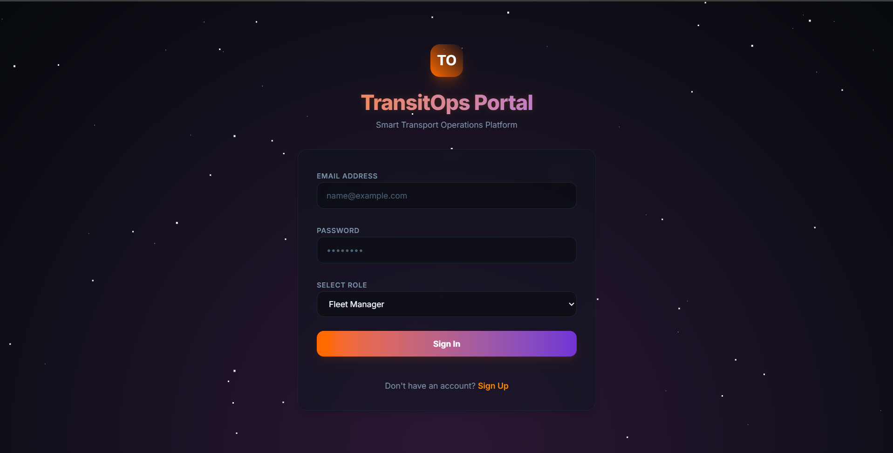

---

### 7.2 Fleet Manager Module
The Fleet Manager profile displays administrative KPIs, active fleet logs, and maintenance records.
| Fleet Dashboard | Vehicles Listing |
|:---:|:---:|
| 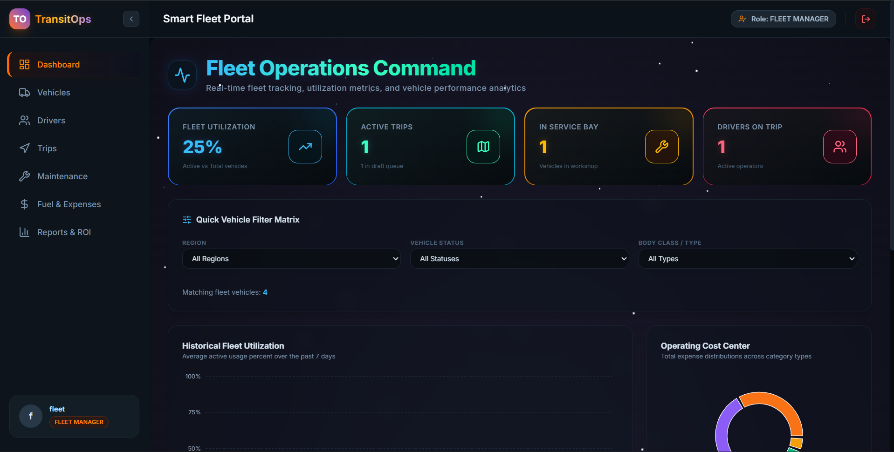 | 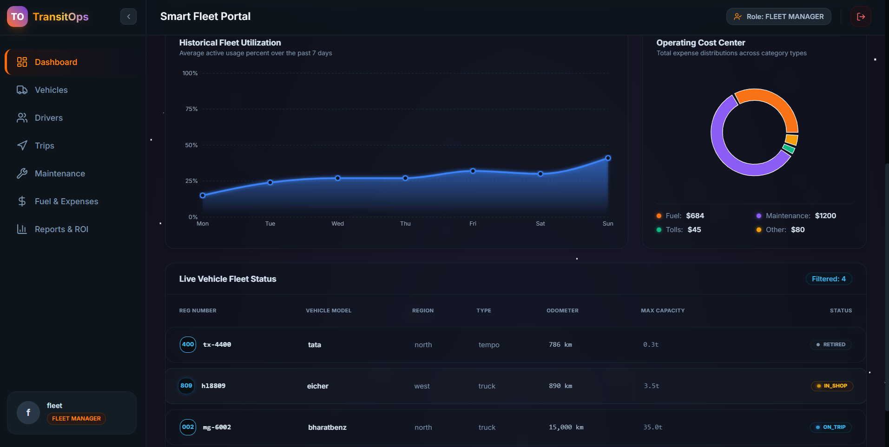 |

| Creating a Vehicle | Editing a Vehicle |
|:---:|:---:|
| 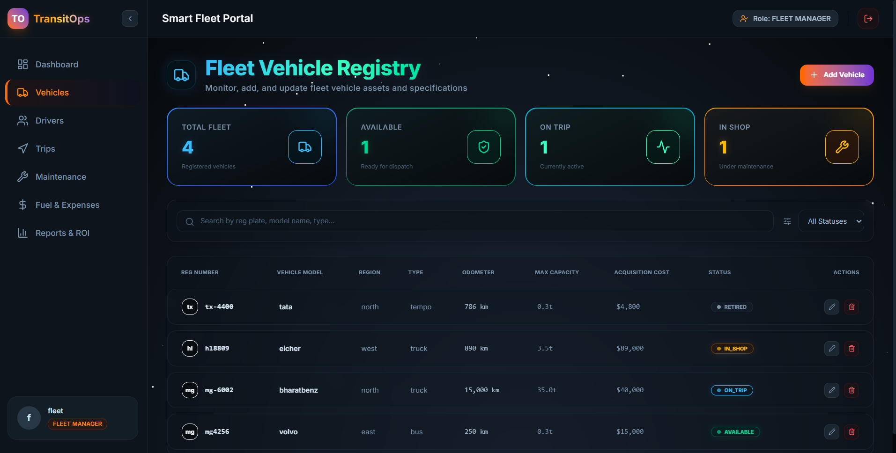 | 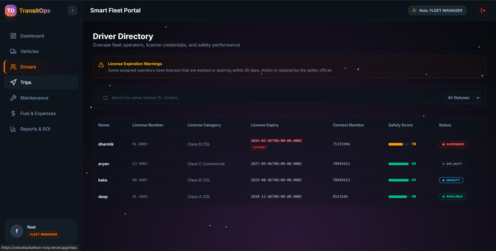 |

| Active Maintenance Workspace | Add Maintenance Log |
|:---:|:---:|
| 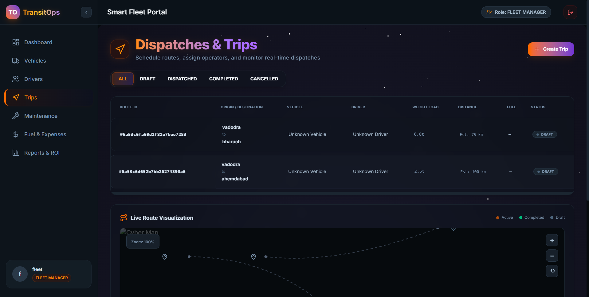 | 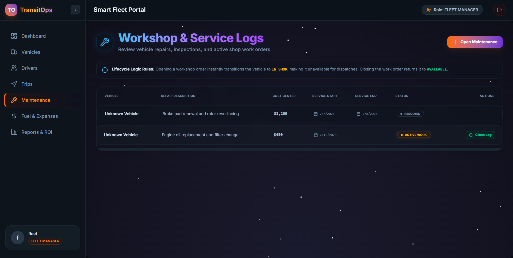 |

| Close Maintenance Work Order |
|:---:|
| 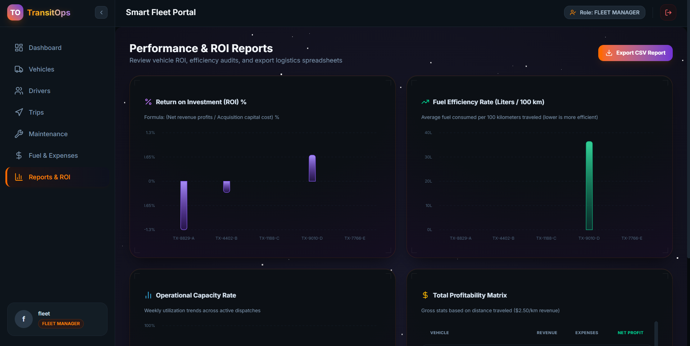 |

---

### 7.3 Driver Module
Drivers can access the active trips logs, perform dispatch operations, or record completion parameters.
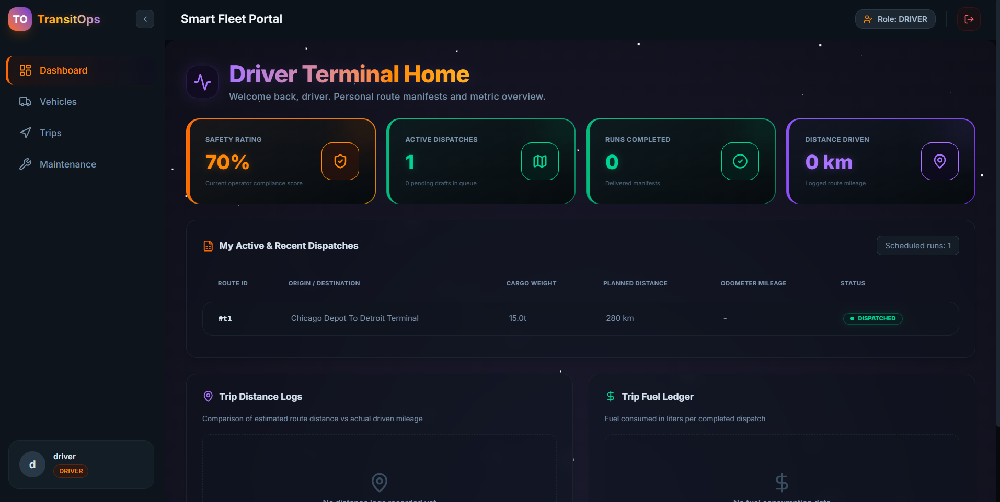

---

### 7.4 Safety Officer Module
Safety officers track license validations, view safety scores, and receive real-time critical events (harsh cornering, speeding warnings).
| Driver Logs Directory | Add Driver Portal |
|:---:|:---:|
| 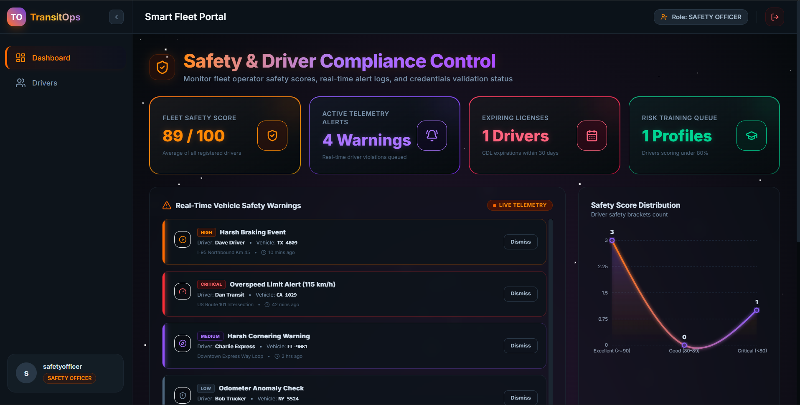 | 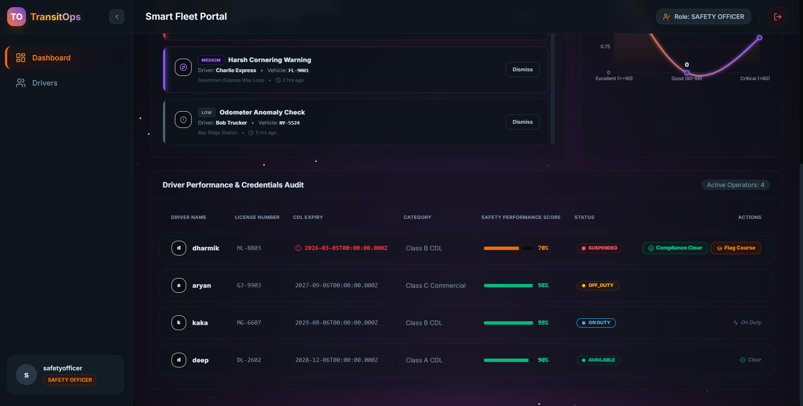 |

---

### 7.5 Financial Analyst Module
Financial analysts access the overall costs ledger, track vehicle ROI data, and view reports overlaid with a custom cosmic stars parallax background.
| Fuel & Expense Ledgers | Financial Reports & ROI Charts |
|:---:|:---:|
| 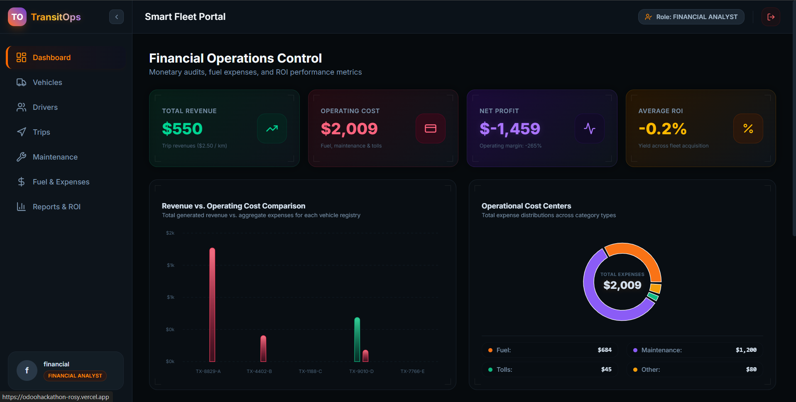 | 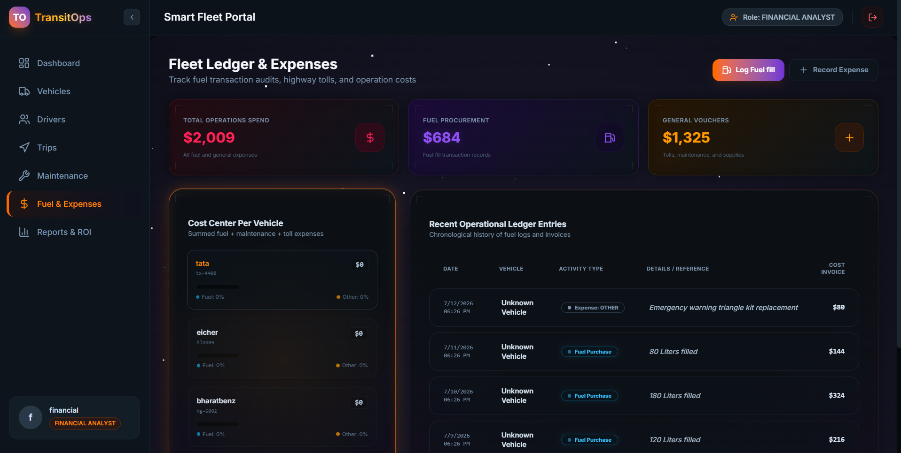 |

---

### 7.6 Database View (MongoDB)
All data records map to collections hosted on MongoDB.
| Drivers Collection Schema | Vehicles Collection Schema |
|:---:|:---:|
| 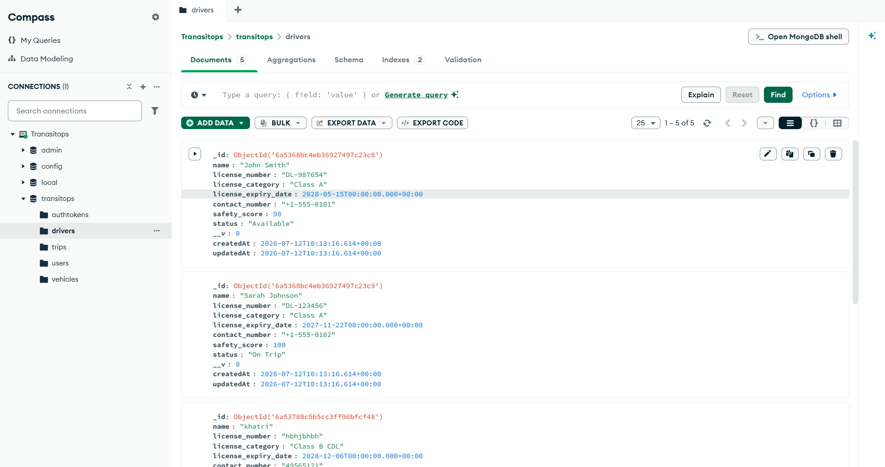 | 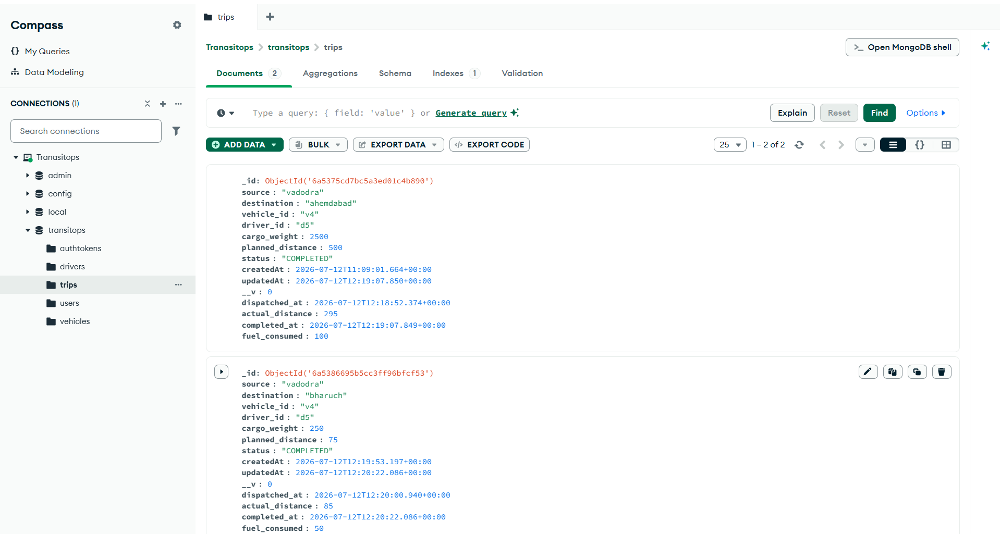 |

---

## 8. Enforced Business Rules

- **Unique Registrations**: Prevents duplicate entry of license numbers or vehicle registration numbers.
- **Operator CDL Check**: Blocks driver assignment if their commercial driver's license is expired or suspended.
- **Unavailable Assets Filter**: Vehicles flagged as `IN_SHOP` or `RETIRED` are automatically hidden from trip dispatch list pickers.
- **Overload Guard**: Rejects trip dispatches when cargo weight exceeds the vehicle's maximum capacity.
- **Double Booking Guard**: System rejects assigning drivers or vehicles that are already on another active trip (`ON_TRIP`).

---

## 9. Setup & Local Development

### Prerequisites
- Node.js (v18+)
- MongoDB (Running locally or an active Atlas Cluster URL)
- A Gmail account with an App Password (if using Nodemailer OTP email feature)

### Backend Setup
1. Open a terminal and navigate to the backend directory:
   ```bash
   cd backend
   ```
2. Install the server dependencies:
   ```bash
   npm install
   ```
3. Create a `.env` file in the `backend/` directory with the following structure:
   ```env
   # Database Connection
   MONGO_URI=mongodb+srv://<username>:<password>@cluster0.mongodb.net/transitops
   
   # JWT Configuration
   JWT_SECRET="YourSecretKeyHere"
   JWT_EXPIRES_IN=1d
   
   # Nodemailer SMTP Email Setup
   EMAIL_USER=your_gmail@gmail.com
   EMAIL_PASS=your_app_password
   ```
4. Run the seed script to populate vehicles and drivers database:
   ```bash
   node seed.js
   ```
5. Start the backend developer API server:
   ```bash
   npm run dev
   ```
   *The server listener will initialize on [http://localhost:5000](http://localhost:5000)*

### Frontend Setup
1. Open a new terminal and navigate to the frontend directory:
   ```bash
   cd frontend
   ```
2. Install the React packages:
   ```bash
   npm install
   ```
3. Launch the React Vite server:
   ```bash
   npm run dev
   ```
   *Open [http://localhost:5173](http://localhost:5173) in your web browser to access the control panel.*

---

<div align="center">


</div>
